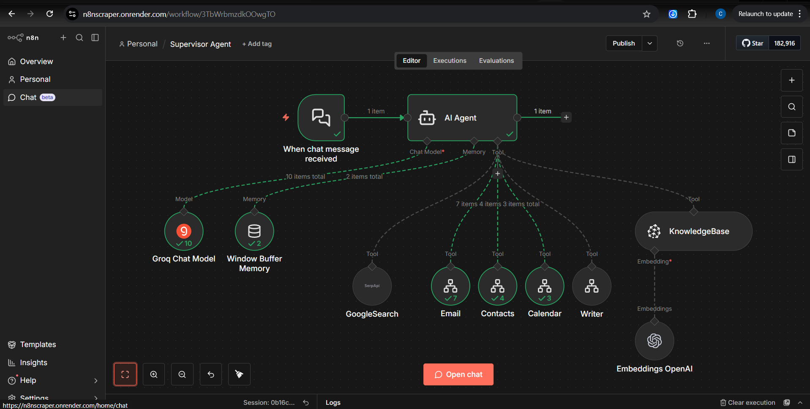

# n8n-multi-agent-supervisor

Multi-agent orchestration in n8n using a **Supervisor** workflow that routes requests to specialized **worker agent** workflows (Email, Contacts, Calendar, Content) and optional **Knowledge Base** retrieval.



## What’s in this repo

These are **n8n workflow exports** (JSON). Import them into your n8n instance.

- `Supervisor Agent.json` — main entrypoint (chat trigger) + orchestrator agent
- `Email Agent.json` — Gmail tools (send/search/get/reply)
- `Contact Agent.json` — Google Contacts tools (get/create/update)
- `Calendar Agent.json` — Google Calendar tools (get events / create event)
- `Content Creator.json` — creative writing worker
- `Update KB.json` — file upload form → chunk → embed → upsert into Pinecone

## How it works (high-level)

- The **Supervisor Agent** receives a chat message (via n8n’s chat trigger).
- It uses tools wired into the Supervisor:
  - Worker workflows exposed as tools via **Tool: Workflow** nodes (Email/Contacts/Calendar/Writer)
  - **GoogleSearch** via SerpAPI
  - **KnowledgeBase** via Pinecone (configured as “retrieve-as-tool”)
- Each worker workflow is triggered by **When Executed by Another Workflow** and expects an input like:

```json
{ "query": "..." }
```

## Setup (n8n)

### 1) Import workflows

Import the JSON files into n8n. Recommended order:

1. Worker workflows: Email, Contact, Calendar, Content Creator
2. Update KB
3. Supervisor Agent

### 2) Configure credentials

You’ll need these credentials in n8n (names may vary by your instance):

- **Groq API** (used as the chat model in Supervisor and most workers)
- **OpenAI API** (used by Contact Agent as chat model; used for embeddings in KB)
- **SerpAPI** (Supervisor’s GoogleSearch tool)
- **Pinecone** (Supervisor KnowledgeBase retrieval + Update KB upsert)
- **Google OAuth2** for:
  - Gmail (Email Agent)
  - Google Contacts (Contact Agent)
  - Google Calendar (Calendar Agent)

### 3) Re-link workflow tools in the Supervisor

When you import workflows into a new n8n instance, **workflow IDs will differ**.

Open the **Supervisor Agent** workflow and, inside each **Tool: Workflow** node (Email/Contacts/Calendar/Writer), re-select the target workflow from the dropdown so they point at the imported workflows.

## Using the system

### Supervisor (chat entrypoint)

The Supervisor workflow contains a chat trigger (“When chat message received”). Use your n8n chat UI / chat endpoint to send a message like:

- “Send an email to Alex asking for a meeting next week.”
- “Find my calendar events tomorrow and summarize the times.”
- “Update Mary’s email address in my contacts.”
- “Write a short Twitter post promoting my new tutorial.”

The Supervisor’s job is to **orchestrate tools** and return a friendly response.

### Knowledge Base (optional)

- `Update KB.json` provides a form trigger (“Load files into KB”). Upload a document to ingest it into Pinecone.
- Once populated, the Supervisor can use the `KnowledgeBase` tool for answering questions grounded in that KB.

## Notes / troubleshooting

- If a worker agent seems to “hallucinate” missing fields (e.g., email recipient, contact IDs), check the worker nodes that use `$fromAI(...)` and ensure the agent prompt/tool descriptions are sufficient.
- Google tools require the correct scopes on the OAuth credential.
- Pinecone requires an existing index (this repo references an index named `n8n-tutorial`).
